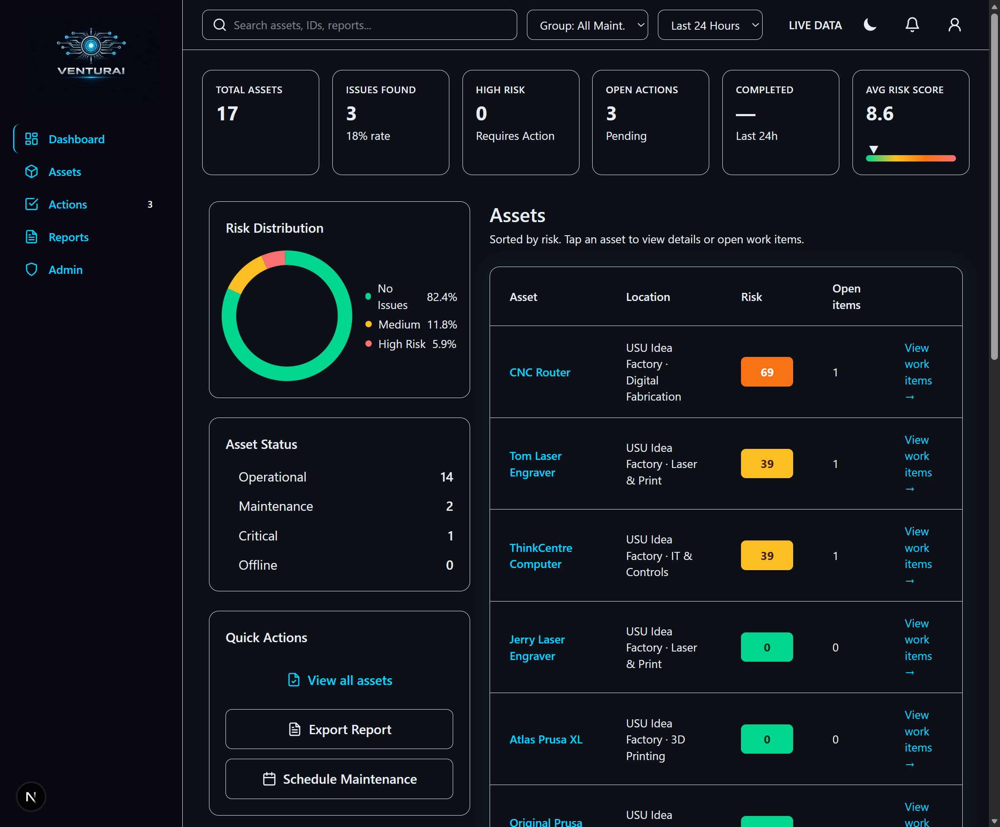
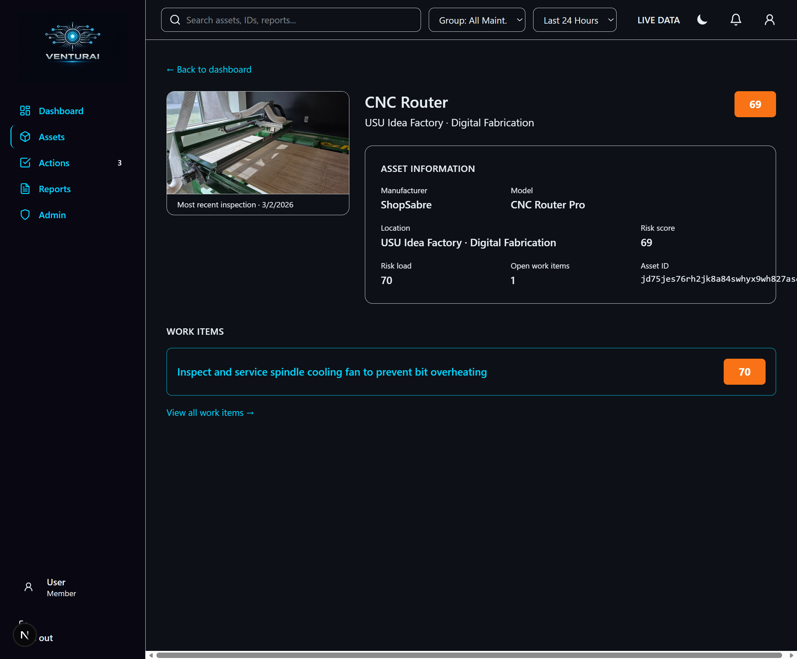
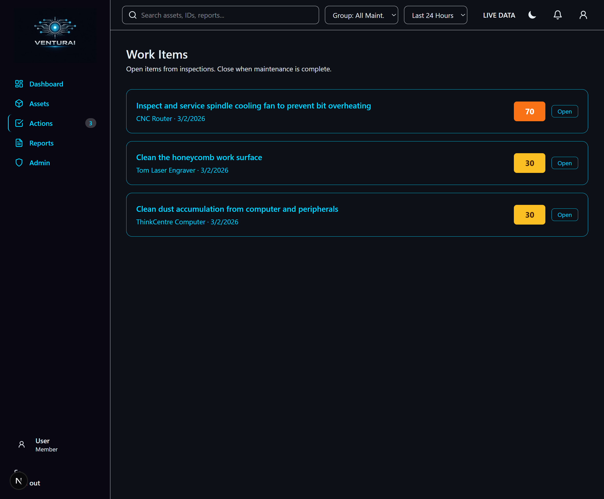
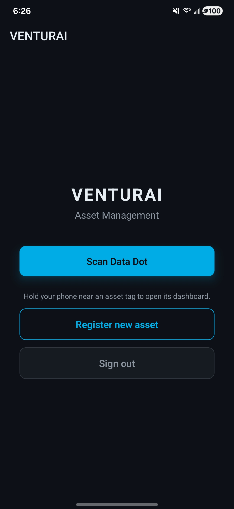
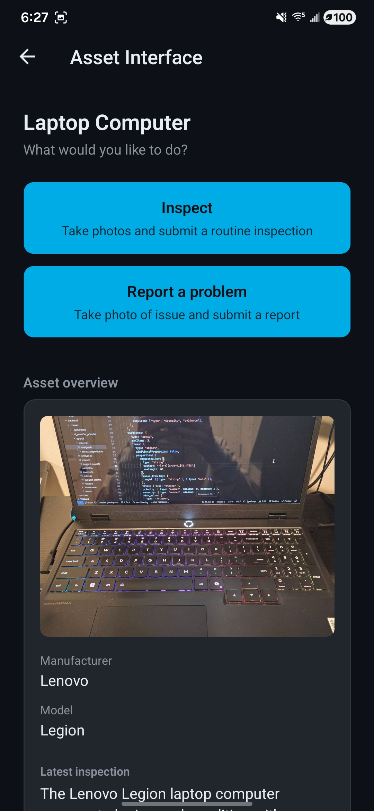
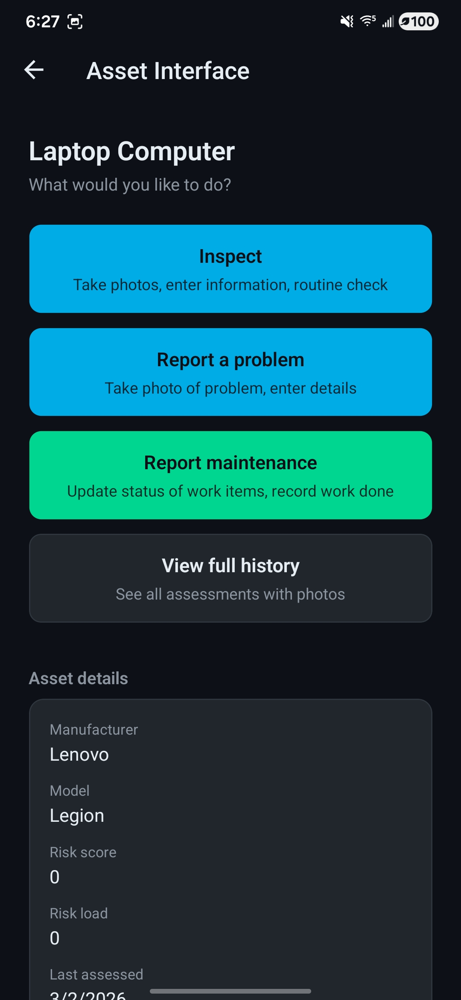

# Venturai

Made in ~19 hours at the HackUSU hackathon, 02/27-28/2026  
[@Spencer1O1](https://github.com/Spencer1O1) · [@bell-kevin](https://github.com/bell-kevin) · [@StevenChristensen444](https://github.com/StevenChristensen444) · [@dillanhart](https://github.com/dillanhart)

## Project Abstract

Venturai is a cross-platform asset assessment and maintenance coordination system that helps teams capture equipment condition in the field, route findings into actionable work items, and monitor operational risk in a shared dashboard. The platform combines guided inspections, role-based workflows, and AI-assisted analysis so inspectors, operators, and maintainers can move from reported issues to tracked remediation with a consistent audit trail.

Technical details: the monorepo uses pnpm + Turborepo with TypeScript across an Expo mobile app, a Next.js web dashboard, and a Convex backend; inspection submissions can include photo evidence and structured questionnaire inputs, while backend functions validate AI outputs and update persistent asset/work-item records.

## Stack

- **pnpm** + **Turborepo**
- **Expo** (Expo Router) mobile app
- **Next.js** web dashboard
- **Convex** backend (auth, DB, serverless functions, storage)
- **Biome** formatter/linter
- **TypeScript** everywhere

## Screenshots & demos

Dashboard (risk overview, asset list, work items):

| [Dashboard](featured-assets/dashboard.png) | [Asset / CNC Router](featured-assets/router_dashboard.png) | [Work items](featured-assets/work_items_dashboard.png) |
|-------------------------------------------|-------------------------------------------------------------|--------------------------------------------------------|
|  |  |  |

Mobile app (home, public asset view, private inspection):

| [App home](featured-assets/app_home.jpg) | [Public asset view](featured-assets/public_view.jpg) | [Private view](featured-assets/private_view.jpg) |
|-----------------------------------------|-------------------------------------------------------|--------------------------------------------------|
|  |  |  |

Videos (may render inline on GitHub; otherwise open the links to play):

<table>
<tr>
<td><strong>App walkthrough</strong><br/><video src="featured-assets/app.mp4" controls width="280"></video><br/><a href="featured-assets/app.mp4">Download app.mp4</a></td>
<td><strong>NFC scan</strong><br/><video src="featured-assets/scan.mp4" controls width="280"></video><br/><a href="featured-assets/scan.mp4">Download scan.mp4</a></td>
</tr>
</table>

## Prerequisites

- **Node.js 18+** (LTS recommended)
- **pnpm** (via `corepack enable` below)
- **Convex account** (free at [convex.dev](https://convex.dev))
- For mobile: **Android Studio** and/or **Xcode** (for device/simulator)

---

## Setup (from scratch)

### 1. Clone and install

```bash
git clone <repo-url>
cd venturai
corepack enable
pnpm install
```

### 2. Convex project and URL

Create a Convex project and get your deployment URL:

```bash
pnpm dev:backend
```

On first run, Convex CLI will prompt you to log in and create or link a project. When it’s running, it will print a URL like `https://xxxxx.convex.cloud`. **Leave this running in a terminal** (or stop it after you’ve copied the URL).

### 3. Environment variables

Copy the example env file and set the Convex URL in **one place** (repo root):

```bash
cp .env.example .env.local
```

Edit **`.env.local`** in the repo root and set the **same** Convex URL for all three variables (no spaces around `=`):

```env
CONVEX_URL=https://your-deployment.convex.cloud
NEXT_PUBLIC_CONVEX_URL=https://your-deployment.convex.cloud
EXPO_PUBLIC_CONVEX_URL=https://your-deployment.convex.cloud
```

- **CONVEX_URL** – used by the Convex CLI and seed script.
- **NEXT_PUBLIC_CONVEX_URL** – used by the Next.js dashboard.
- **EXPO_PUBLIC_CONVEX_URL** – used by the Expo mobile app.

A **postinstall** script symlinks (or copies) root `.env.local` into `apps/web`, `apps/expo`, and `backend`. If you add or change vars later, run `pnpm install` from the repo root so packages pick up the file again.

### 4. Convex dashboard: OpenAI key (for seed)

The Idea Factory seed uses AI to evaluate inspection photos. Add your OpenAI API key in Convex:

1. Open the [Convex dashboard](https://dashboard.convex.dev), select your project.
2. Go to **Settings → Environment Variables**.
3. Add **OPENAI_API_KEY** with your key (required for `pnpm run seed:idea-factory`).

### 5. Run the seed (optional but recommended)

Seed creates the **USU Idea Factory** org, assets, a seed user **idea@mail.com** / **password**, and runs real AI assessments on bundled photos.

From the **repo root**:

```bash
pnpm run seed:idea-factory
```

Requirements:

- **CONVEX_URL** in root (or `backend`) `.env.local` (step 3).
- **OPENAI_API_KEY** set in Convex (step 4).
- Backend deployed (e.g. run `pnpm dev:backend` once so Convex has the latest functions).

Seed images are under `data/usu/idea_factory/` in the repo; the script uploads them and runs assessments. After seeding you can sign in on the dashboard or mobile as **idea@mail.com** / **password** and see the Idea Factory org and assets.

To re-seed from a clean slate: in the Convex dashboard run the mutation **seed:clearIdeaFactorySeed** (with optional `orgName: "USU Idea Factory"`), then run `pnpm run seed:idea-factory` again.

---

## Running the app

### All three (backend + web + Expo) in parallel

From repo root:

```bash
pnpm dev
```

- **Backend**: Convex dev server (functions, schema, sync).
- **Web**: Next.js dashboard (e.g. http://localhost:3000).
- **Expo**: Metro bundler; press `w` for web, `a` for Android, `i` for iOS.

### Run individually

```bash
pnpm dev:backend   # Convex (keep running while using app)
pnpm dev:web       # Next.js dashboard
pnpm dev:expo      # Expo (then choose platform)
```

### Mobile device / simulator

```bash
pnpm dev:expo
# then: a (Android) or i (iOS)
# or:
pnpm dev:android
pnpm dev:ios
```

Ensure **EXPO_PUBLIC_CONVEX_URL** is set in `.env.local` (same as CONVEX_URL) so the app talks to your Convex deployment.

---

## Useful scripts

| Command | Description |
|--------|-------------|
| `pnpm dev` | Run backend + web + Expo together (no nfc) |
  
| `pnpm dev:backend` | Convex dev server |
| `pnpm dev:web` | Next.js dashboard |
| `pnpm dev:expo` | Expo (Metro) |
| `pnpm expo:prebuild` Prebuilds native folders |
| `pnpm dev:android` | Run expo dev client for android (with nfc, requires prebuild) |
| `pnpm run seed:idea-factory` | Seed Idea Factory org, user, and AI assessments |
| `pnpm lint` | Lint all packages |
| `pnpm format` | Format with Biome |
| `pnpm typecheck` | Type-check all packages |
| `pnpm build` | Build all packages |
| `pnpm test` | Run tests |
| `pnpm clean` | Remove node_modules, .turbo, build caches |

---

## Project layout

```
venturai/
├── apps/
│   ├── expo/          # Mobile app (Expo Router)
│   └── web/           # Next.js dashboard
├── backend/           # Convex (schema, functions, auth, seed)
│   ├── convex/
│   └── scripts/
├── data/              # Seed images (e.g. data/usu/idea_factory/...)
├── scripts/           # Shared scripts (e.g. symlink-env.js)
├── tooling/
├── .env.example
├── .env.local         # Your env (create from .env.example)
└── package.json
```

Environment: **one** `.env.local` at the repo root (see step 3); it is symlinked into apps and backend so Convex URL and other vars are shared.


